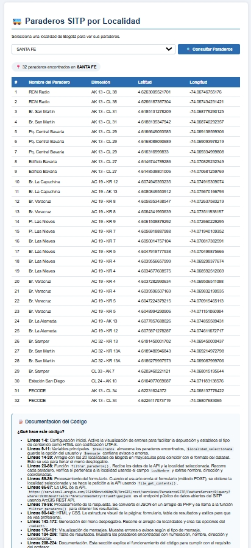
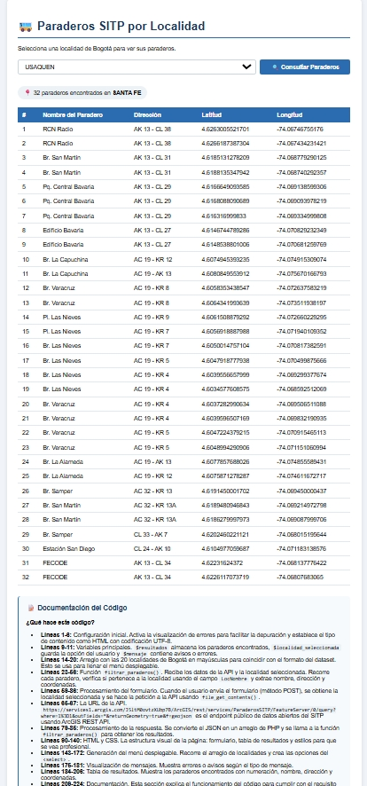

#  Paraderos SITP por Localidad

##  Descripción
Aplicación web en PHP que consume la API pública de Datos Abiertos de Bogotá para consultar paraderos del SITP por localidad.

##  Tecnologías
- PHP 8.2
- HTML5 / CSS3
- XAMPP
- ArcGIS REST API

##  Características
-  Menú desplegable con 20 localidades de Bogotá
-  Consulta a la API pública del SITP
-  Filtrado de paraderos por localidad
-  Visualización en tabla HTML
-  Manejo de errores
-  Documentación del código

##  Instalación
1. Clonar el repositorio
2. Copiar a `C:\xampp\htdocs\paraderos\`
3. Iniciar Apache en XAMPP
4. Acceder a `http://localhost/paraderos/`

## 📸 Evidencia de funcionamiento

### Localidad: SANTA FE (32 paraderos encontrados)

### Localidad: USAQUEN

##  Autor
Hermes Solorzano

## 📚 Contexto
Esta evidencia fue desarrollada como parte de la formación en el SENA, demostrando la capacidad de consumir APIs públicas y procesar datos en PHP.
